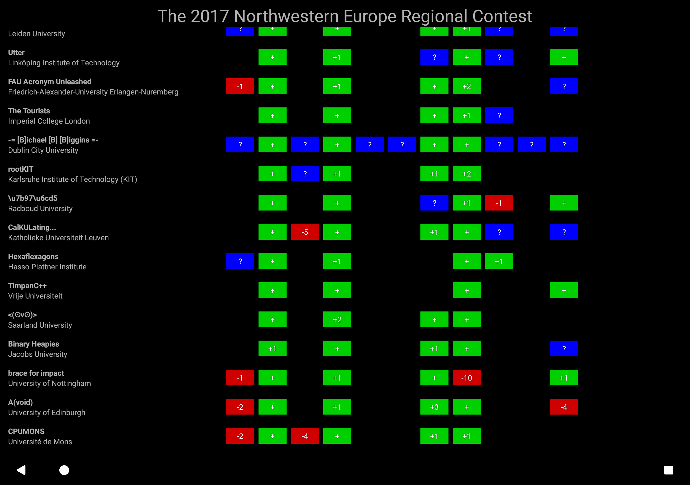
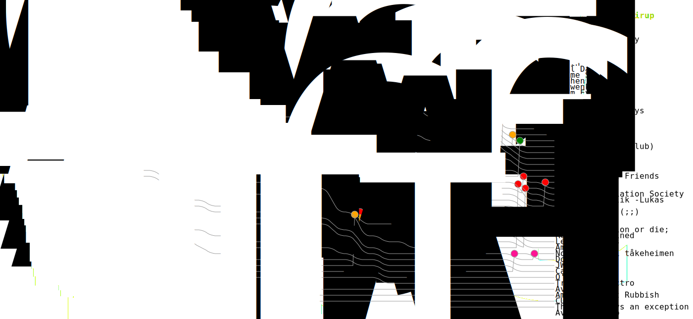

DOMJudge scoreboard parser
==========================

A graphical tool for revealing the results of the final hour from running ACM
ICPC style programming contests. Compatible with DOMjudge and any contest
server implementing the CLICS API spec.



To replay the final hour of an example contest try running:

```
bazel run scoreboards/console -- \
    --url https://www.domjudge.org/demoweb/api/ \
    --groups=Participants \
  resolver
```

More information about how to download contests for later, as well as the other
build targets for Android and desktop apps, are available in each of the
directories under scoreboards/\*.

The code is organised into a self-contained library and can be used without much
in the way of boilerplate for any kind of scripting task involving contests. For
example, the following image representing NWERC 2007 scores was generated from a
standalone Java program:


